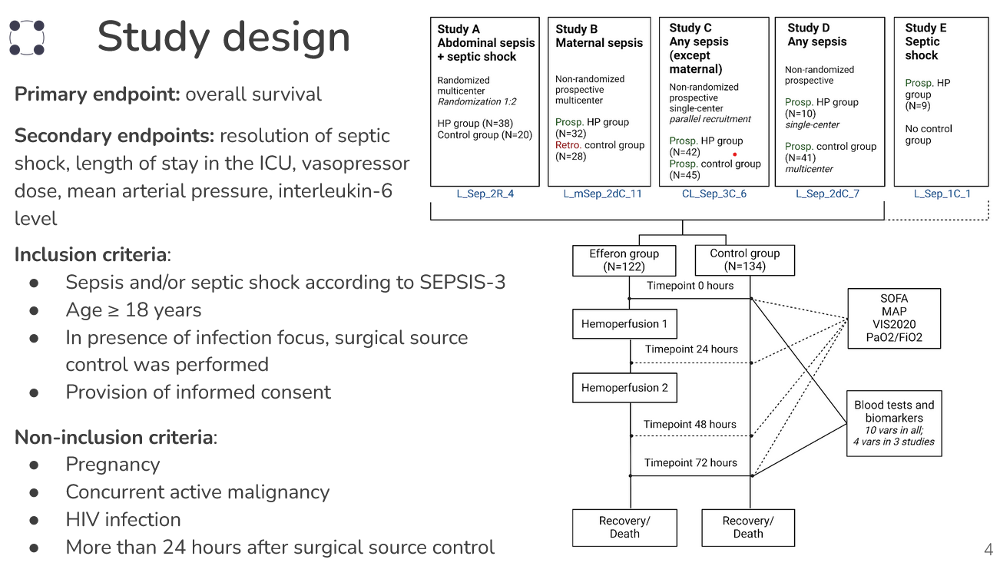
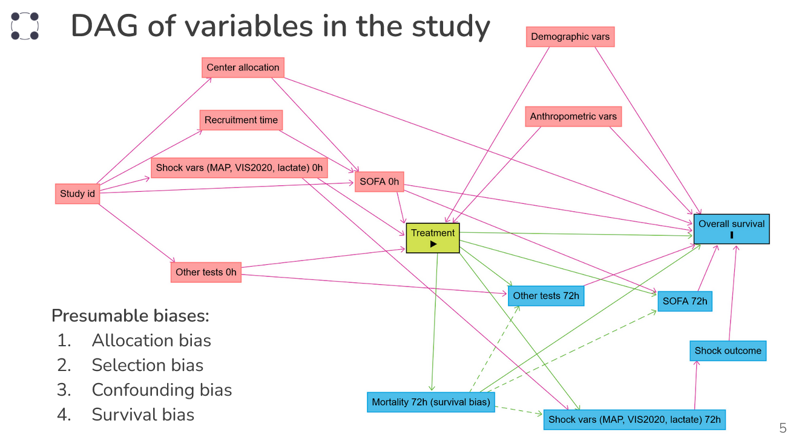
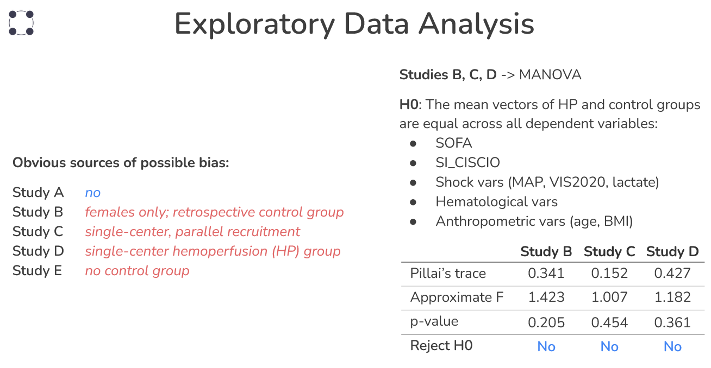
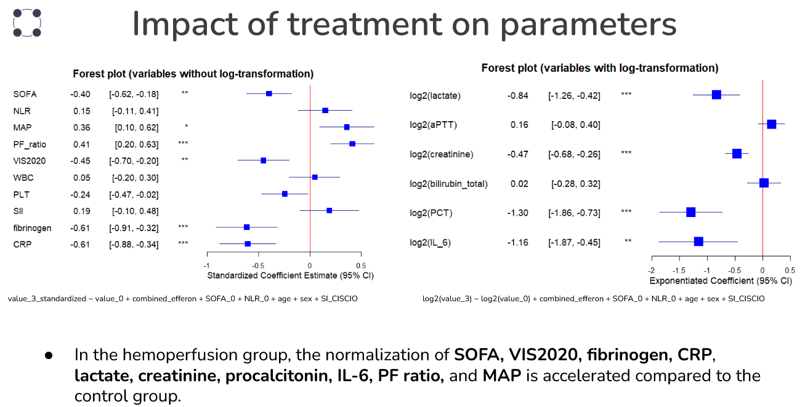
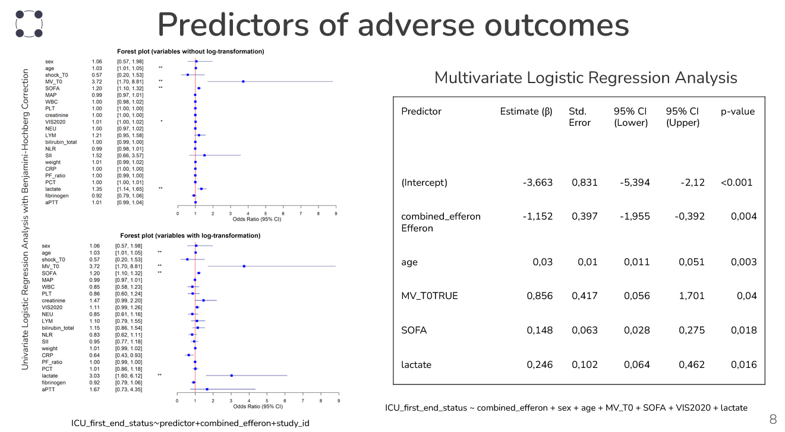
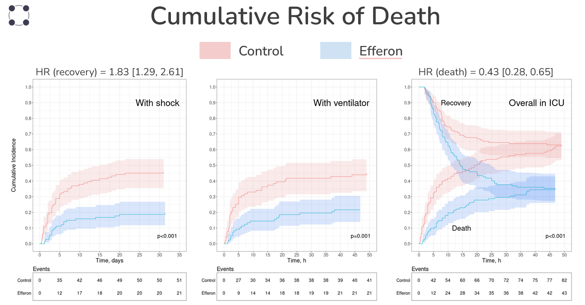
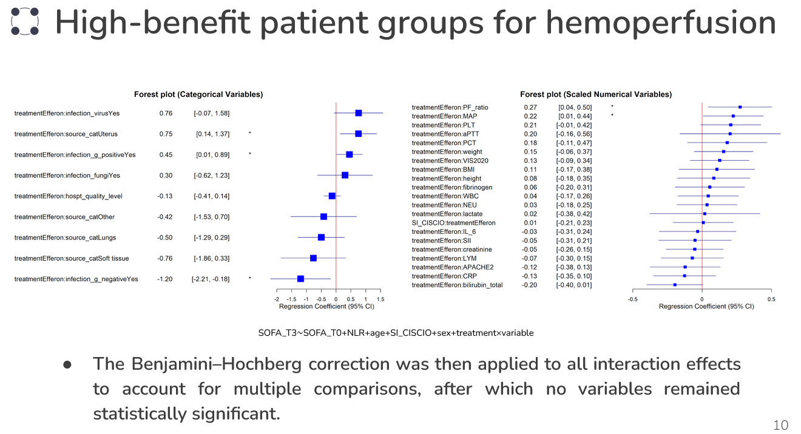

# Impact of Hemoperfusion on Outcomes and Clinical Dynamics in Treatment of Bacterial Sepsis

This repository contains materials of the term project which was performed at the 2024 Biostatistics educational program of the [Bioinformatics Institute](https://bioinf.me/en). 

## Contributors   

**Students**  

- [Nikita Gladyshev](https://github.com/Hayrest) (*Avtsyn Research Institute of Human Morphology*)  
- [Anastasiia Potamoshneva](https://github.com/a-potamoshneva) (*Universitätsmedizin Göttingen*)  
- [Oleg Tarasov](https://github.com/ovtarasov) (*Bioinformatics Institute*)  
- [Victoria Uvarova](https://github.com/UvarovaV) (*Chumakov Federal Scientific Center for Research and Development of Immune-and-Biological Products of Russian Academy of Sciences (Institute of Poliomyelitis)*)  

**Tutors**  

- Alexander Popov (*Efferon PJSC*)  
- Evgeny Bakin (*Bioinformatics Institute*) 
 
## Directory structure

- [abandoned](abandoned/) -- temporary folder with personal subfolders named `_<name>`  
- [code](code/) -- all code; RMarkdown notebooks (`*.Rmd`) are in the root of this folder   
    - [code/DAG](code/DAG/) -- contains the DAG model 
    - [code/scripts](code/scripts/) -- separate R scripts (`*.R`)  
- [data](data/) -- data files **NB! Do not upload actual data!**    
    - [data/processed](data/processed/) -- intermediate results in `.rds` format   
    - [data/raw](data/raw) -- raw source data  
- [discussions](discussions) -- notes from our discussions
- [figures](figures/) -- figures and visualizations  
- [reports](reports/) -- rendered reports

## Background

Lipopolysaccharide (LPS), a membrane compound of gram-negative bacteria, triggers the inflammatory response and cytokine production, leading to a "cytokine storm" that drives sepsis severity [1,2]. The Efferon LPS hemoperfusion device employs a multimodal polymeric adsorbent to eliminate LPS and inflammatory mediators. Previous clinical study confirmed its safety and efficacy, showing a significant decrease in early 3-day mortality and improvement in proinflammatory blood markers levels [3,4]. 

**Aim:** To evaluate the efficacy of Efferon hemoperfusion in patients with sepsis.

**Objectives:**

- ● Identify clinical / laboratory parameters most affected by treatment.
- ● Compare overall survival, rate of septic shock resolution between experimental and control patient groups.
- ● Identify parameters most associated with mortality.
- ● Identify patient subgroups associated with higher probability of benefiting from hemoperfusion.

## Data

Data was collected from 5 clinical trials (2019-2024).

The Last Observation Carried Forward (LOCF) method was applied to address survival bias.

## Results

MANOVA showed no significant differences in baseline clinical and laboratory parameters between control and experimental groups among studies.

## Conclusions

1. Analysis revealed that 4 out of 5 studies were comparable in key characteristics, allowing them to be combined for evaluating hemoperfusion effect.

2. Efferon therapy is associated with increased survival in ICU patients diagnosed with shock and receiving mechanical ventilation.

3. Patients with shock who received Efferon therapy demonstrated a faster normalization of vital signs compared to the control group.

4. ICU patient survival depends on age, mechanical ventilation status, SOFA score, and lactate levels.

5. Hemoperfusion with Efferon reduces mortality and increases the chances of shock resolution across all included studies.

## References

1. [Virzì, G.M.; Mattiotti, M.; de Cal, M.; Ronco, C.; Zanella, M.; De Rosa, S. Endotoxin in Sepsis: Methods for LPS Detection and the Use of Omics Techniques. Diagnostics (Basel) 2022, 13, 79, doi:10.3390/diagnostics13010079.](https://doi.org/10.3390/diagnostics13010079)
2. [Noori, M.S.; Courreges, M.C.; Bergmeier, S.C.; McCall, K.D.; Goetz, D.J. Modulation of LPS-Induced Inflammatory Cytokine Production by a Novel Glycogen Synthase Kinase-3 Inhibitor. Eur J Pharmacol 2020, 883, 173340, doi:10.1016/j.ejphar.2020.173340.](https://doi.org/10.1016/j.ejphar.2020.173340)
3. [Rey, S.; Kulabukhov, V.M.; Popov, A.; Nikitina, O.; Berdnikov, G.; Magomedov, M.; Kim, T.; Masolitin, S.; Ignatenko, O.; Krotenko, N.; et al. HEMOPERFUSION USING THE LPS-SELECTIVE MESOPOROUS POLYMERIC ADSORBENT IN SEPTIC SHOCK: A MULTICENTER RANDOMIZED CLINICAL TRIAL. Shock 2023, 59, 846, doi:10.1097/SHK.0000000000002121.](https://doi.org/10.1097/SHK.0000000000002138)
4. [Efferon JSC Lipopolysaccharide Adsorption At Septic Shock with Efferon LPS Extracorporeal Blood Adsorbers; clinicaltrials.gov, 2024;](https://ctv.veeva.com/study/lipopolisaccharide-adsorption-at-septic-shock)

  